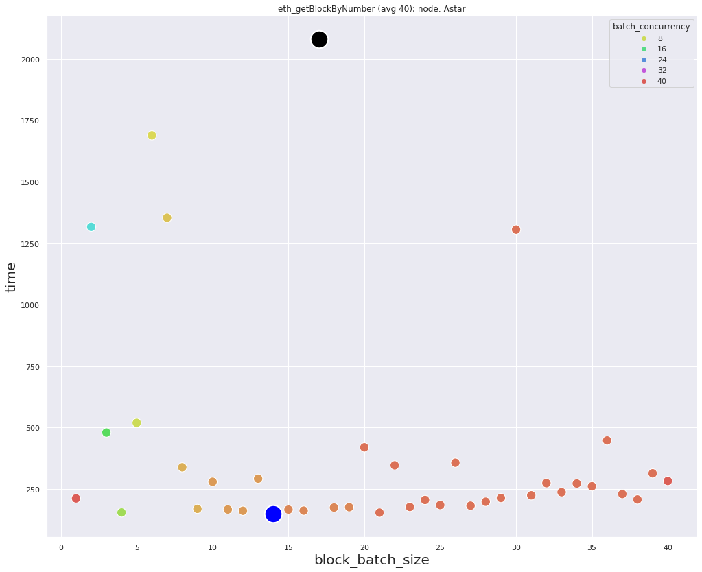
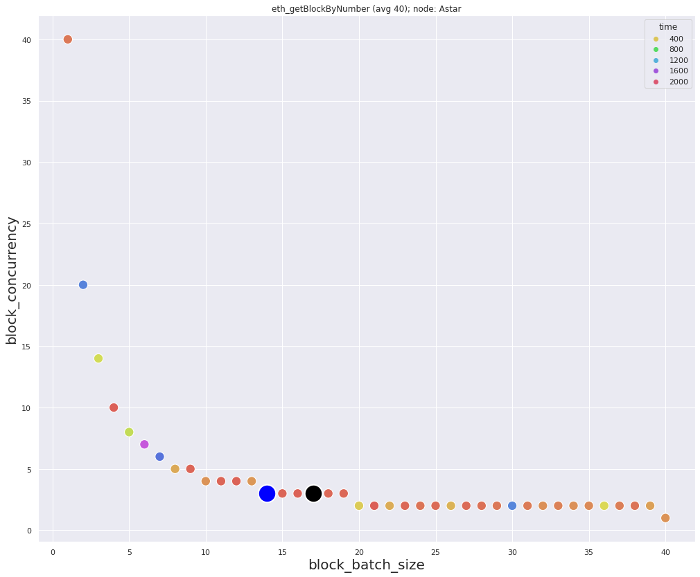
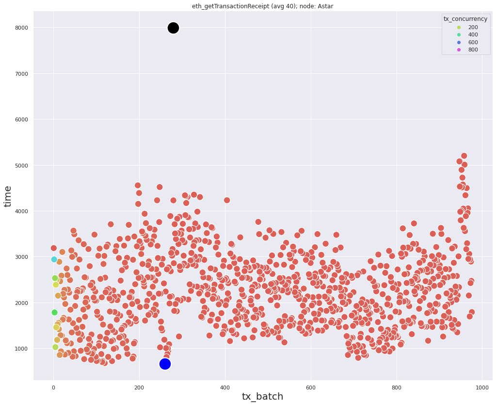

### Data for *eth_getBlockByNumber* requests
Minimum `150.5` milliseconds, with: `block_batch_size=14`, `block_concurrency=3`  
Maximum `2081.1` milliseconds, with: `block_batch_size=17`, `block_concurrency=3`  
Average: `413` milliseconds

  

### Data for *eth_getTransactionReceipt* requests
`num_of_hashes=976`  
Minimum `667.3` milliseconds, with: `tx_batch=260`, `tx_concurrency=4`  
Maximum `7995.2` milliseconds, with: `tx_batch_size=279`, `tx_concurrency=4`  
Average: `2257` milliseconds

### Description
The minimum and maximum are reached at the same concurrency value. Therefore, the choice of the batch size is critical.  
Block density `~24.4` transactions in each block.
