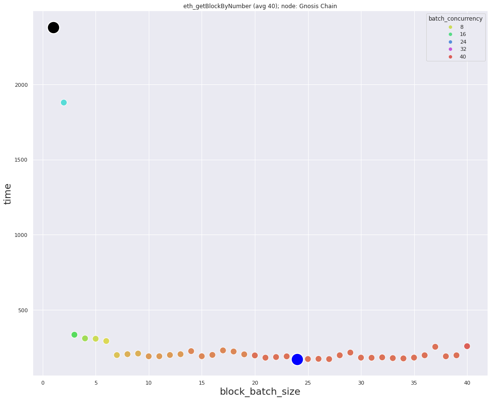
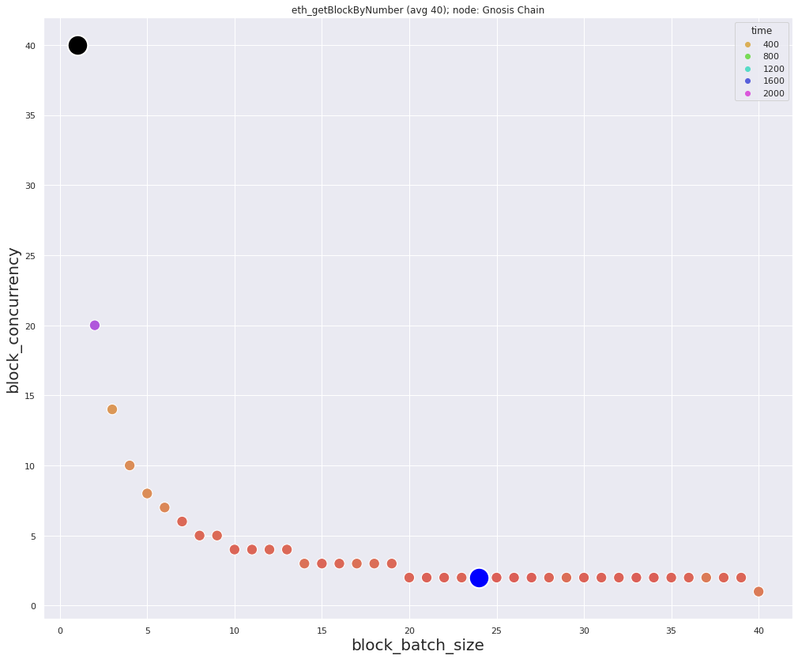
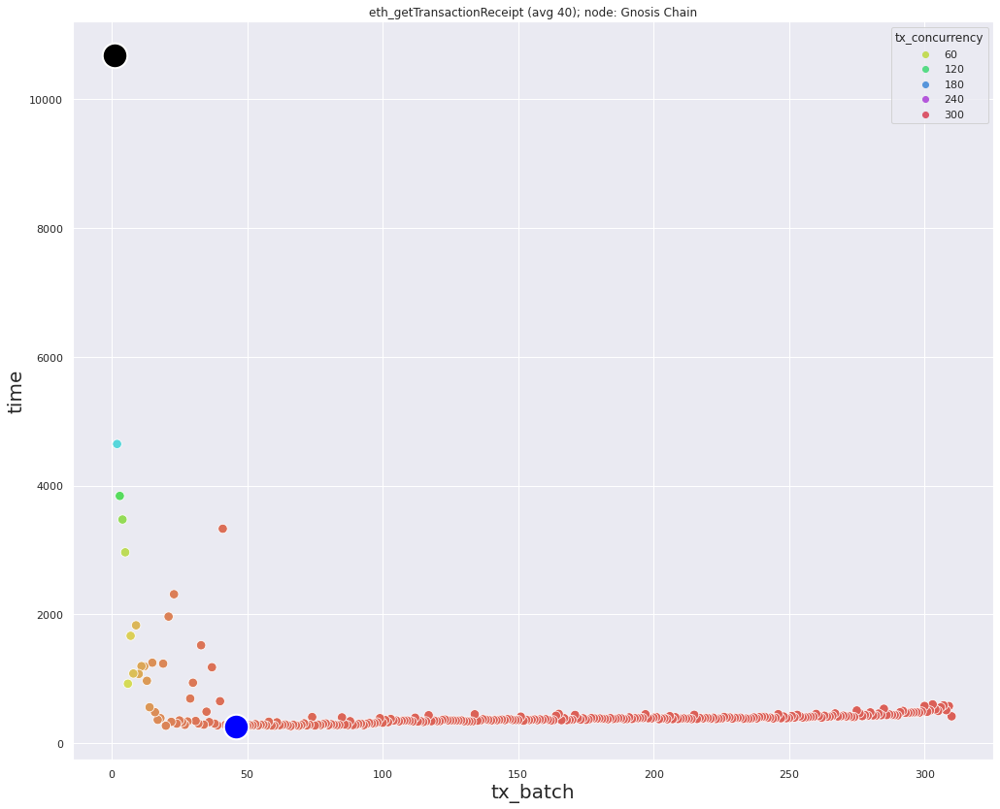

### Data for *eth_getBlockByNumber* requests
Minimum `172.5` milliseconds, with: `block_batch_size=24`, `block_concurrency=2`  
Maximum `2379.4` milliseconds, with: `block_batch_size=1`, `block_concurrency=40`  
Average: `305` milliseconds

  

### Data for *eth_getTransactionReceipt* requests
`num_of_hashes=310`  
Minimum `259.3` milliseconds, with: `block_batch_size=46`, `block_concurrency=7`  
Maximum `10687.5` milliseconds, with: `block_batch_size=1`, `block_concurrency=310`  
Average: `507` milliseconds

### Description
Quite stable node. Low average in each type of request shows slight differences in the selection of optimal parameter values.  
Block density `~7.75` transactions in each block.
