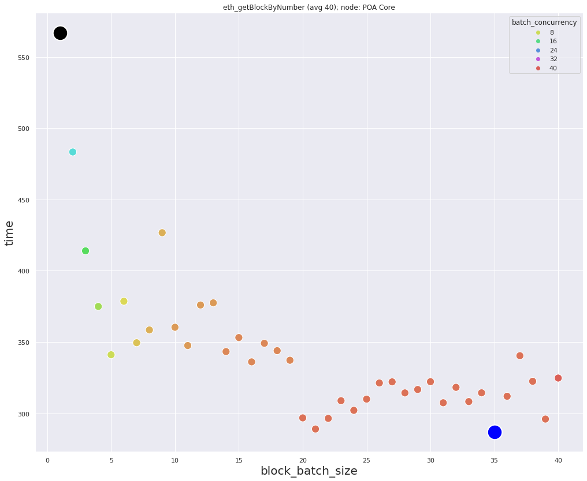
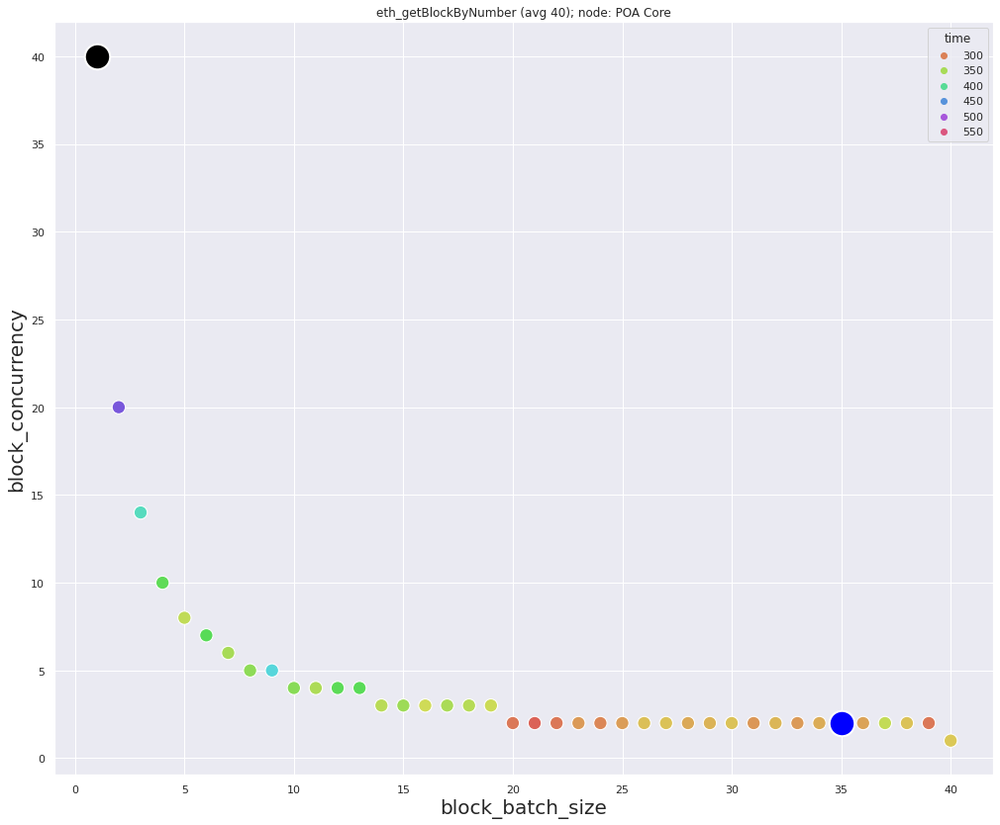
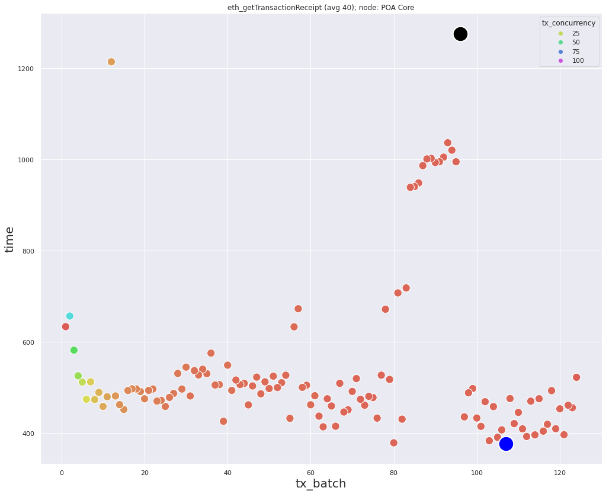

### Data for *eth_getBlockByNumber* requests
Minimum `287` milliseconds, with: `block_batch_size=35`, `block_concurrency=2`  
Maximum `566` milliseconds, with: `block_batch_size=1`, `block_concurrency=40`  
Average: `343` milliseconds

  

### Data for *eth_getTransactionReceipt* requests
`num_of_hashes=124`  
Minimum `376.5` milliseconds, with: `tx_batch=107`, `tx_concurrency=2`  
Maximum `1275` milliseconds, with: `tx_batch=96`, `tx_concurrency=2`  
Average: `547` milliseconds

### Description
Minimum and maximum due *eth_getTransactionReceipt* requests located very close.  
In places on the graph it can be seen that the points fit well next to each other. This means the stability of server response.  
Block density `~3.1` transactions in each block.
