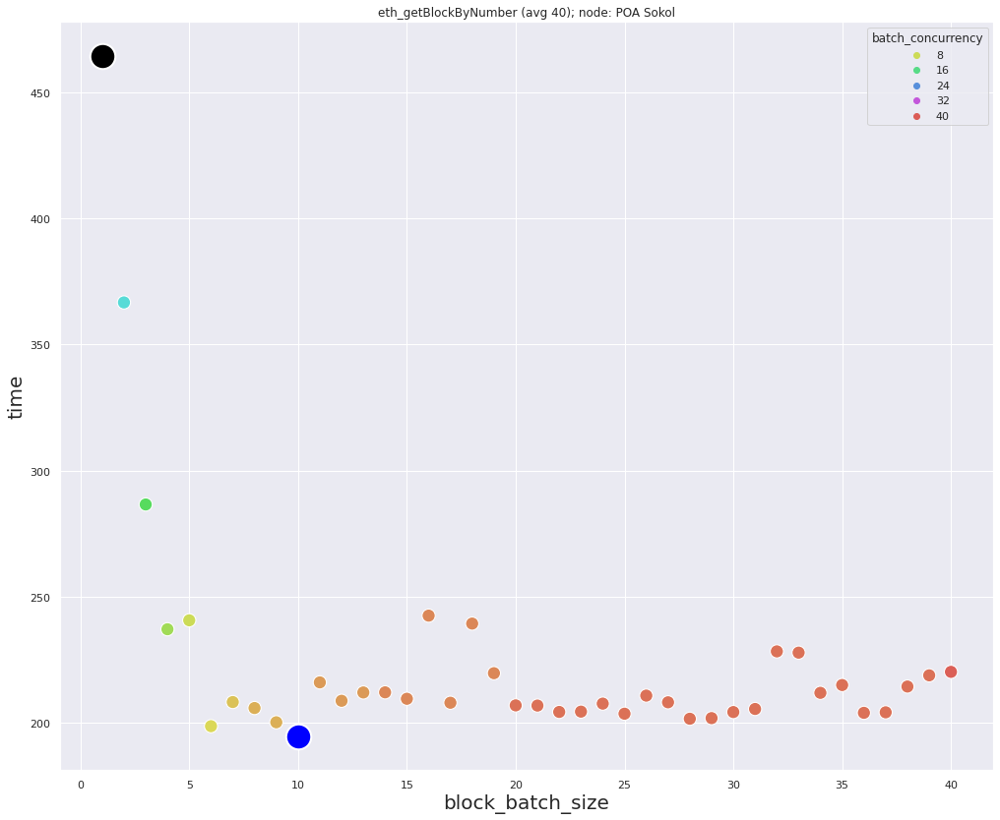
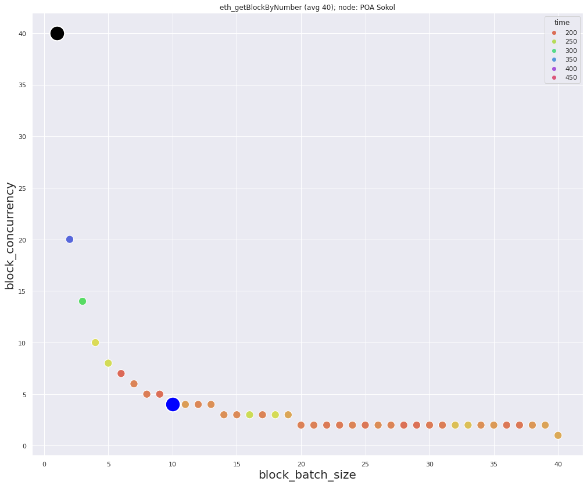
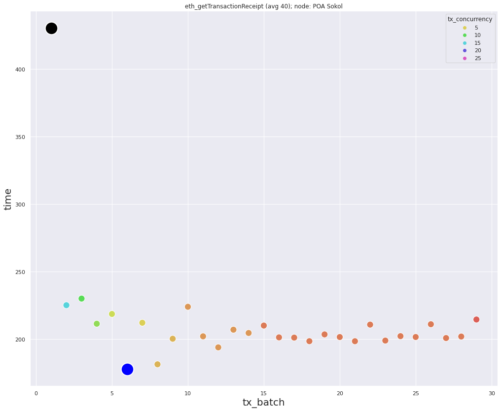
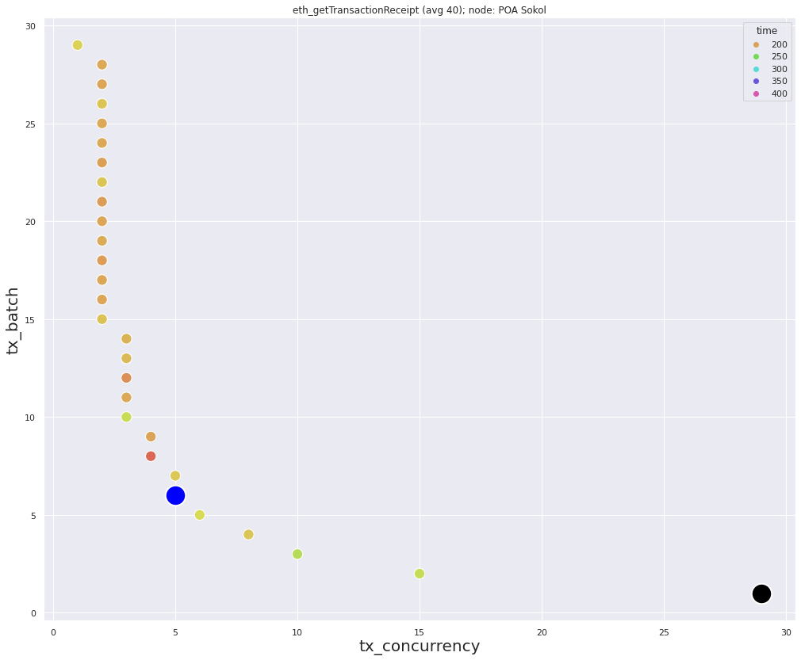

### Data for *eth_getBlockByNumber* requests
Minimum `194.6` milliseconds, with: `block_batch_size=10`, `block_concurrency=4`  
Maximum `464.5` milliseconds, with: `block_batch_size=1`, `block_concurrency=40`  
Average: `224` milliseconds

  

### Data for *eth_getTransactionReceipt* requests
`num_of_hashes=29`  
Minimum `177.7` milliseconds, with: `tx_batch=6`, `tx_concurrency=5`  
Maximum `430.2` milliseconds, with: `tx_batch=1`, `tx_concurrency=29`  
Average: `212.8` milliseconds

### Description
Pretty stable node. Low average in each type of requests. To the same extent it caused by low block density.
Block density `~0.725` transactions in each block.
