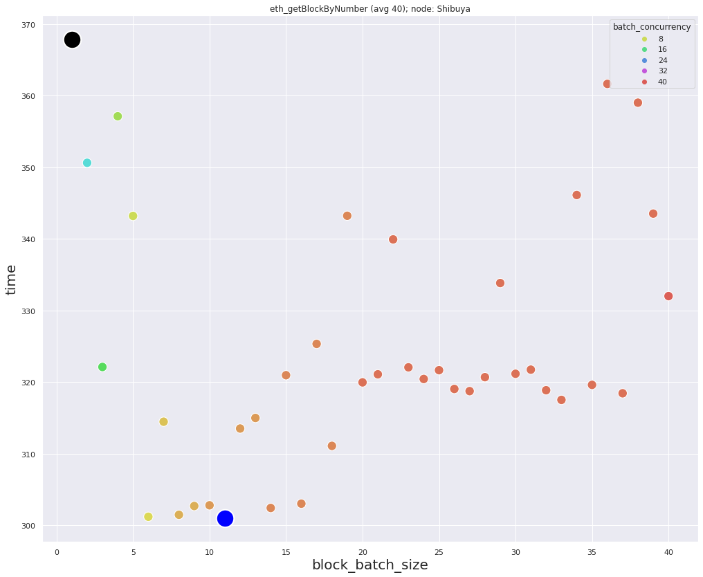
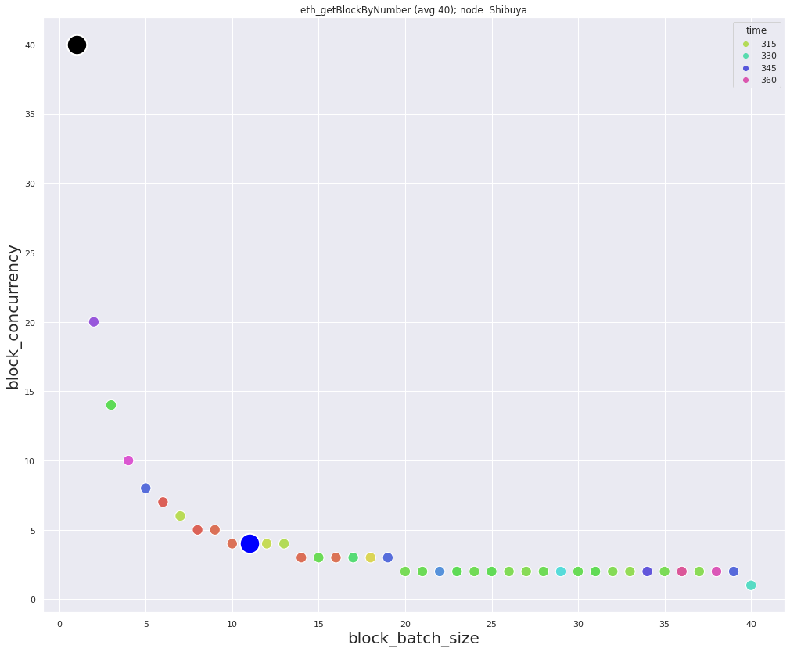
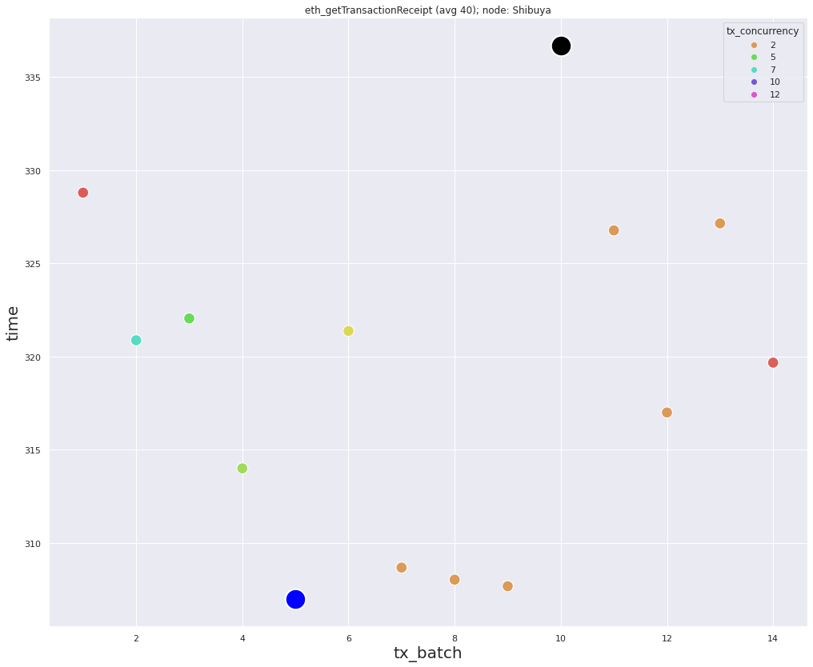
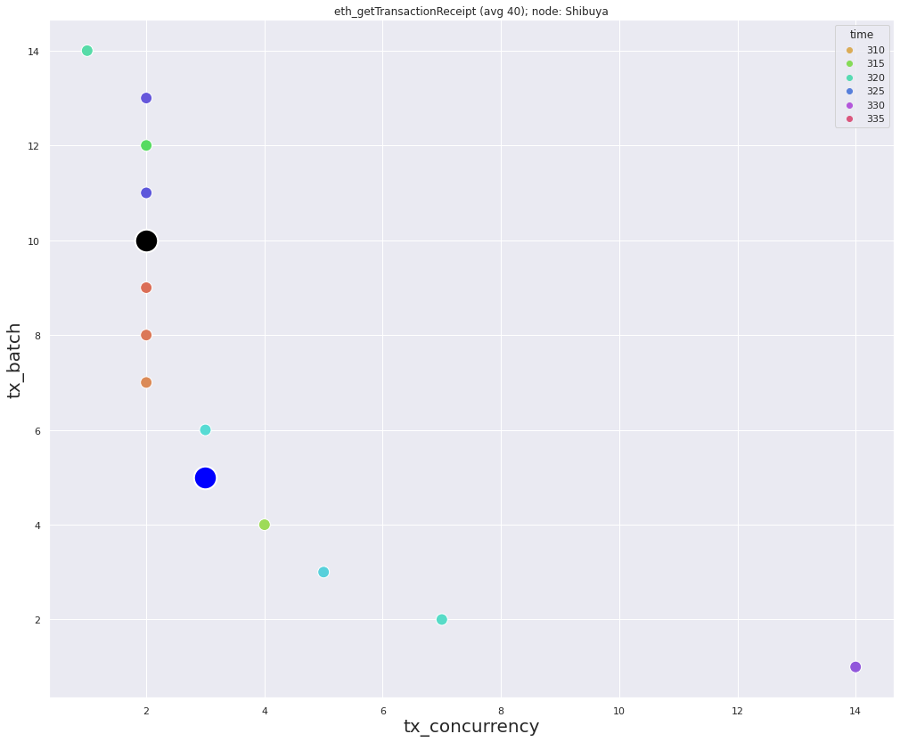

### Data for *eth_getBlockByNumber* requests
Minimum `301` milliseconds, with: `block_batch_size=11`, `block_concurrency=4`  
Maximum `367.8` milliseconds, with: `block_batch_size=1`, `block_concurrency=40`  
Average: `324.8` milliseconds

  

### Data for *eth_getTransactionReceipt* requests
`num_of_hashes=14`  
Minimum `307.0` milliseconds, with: `tx_batch=5`, `tx_concurrency=3`  
Maximum `336.7` milliseconds, with: `tx_batch=10`, `tx_concurrency=2`  
Average: `318.9` milliseconds

### Description
During *eth_getTransactionReceipt* requests a lot of response was **403 Forbidden**. This caused a large spread of points on the plots.
Block density `~0.35` transactions in each block.
